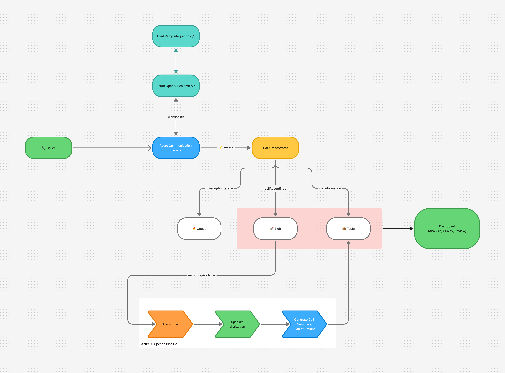
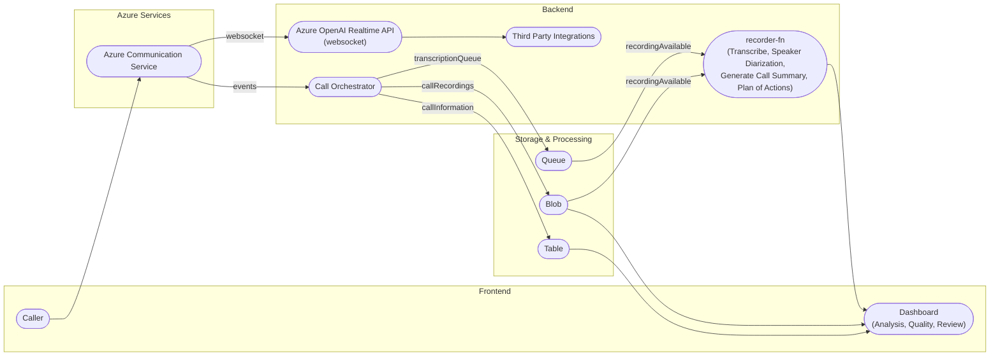
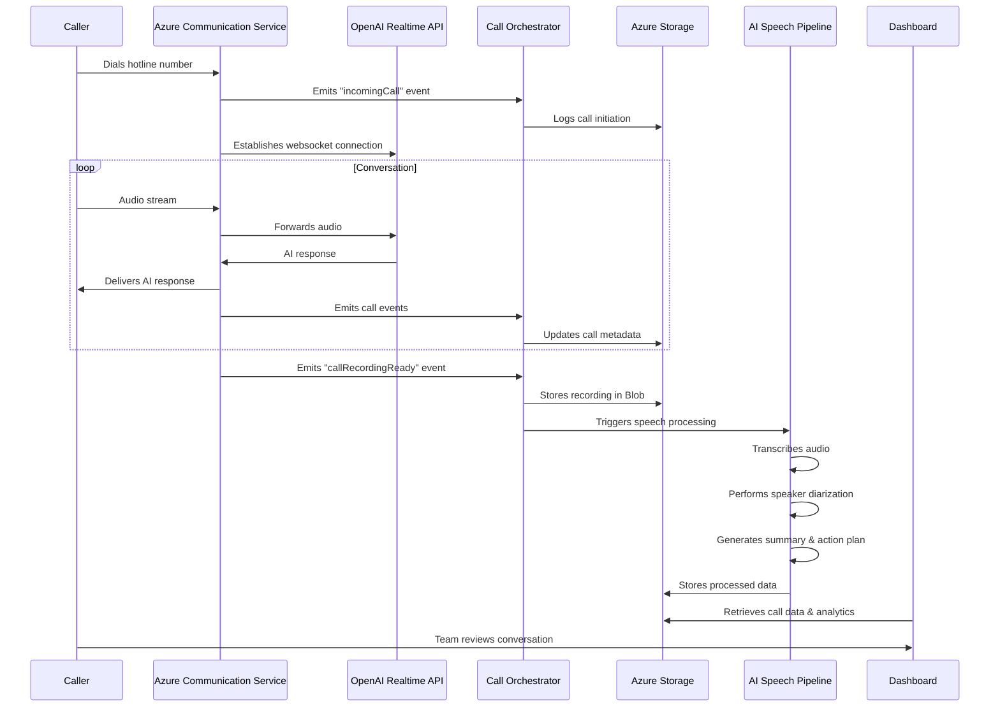

# 🔊 FirstResponder-AI: Azure-Powered Realtime Call Intelligence

FirstResponder-AI is a real-time, low-latency voice agent powered by OpenAI's Realtime APIs and Azure Communication Services. Leveraging advanced Speech-to-Speech (S2S) architectures and multimodal AI models, it enables natural, human-like conversations with minimal delay. This solution is designed to revolutionize customer support by providing instant, scalable, and highly personalized voice interactions.


## 🚀 Key Benefits

- ⚡ **Real-Time, Low-Latency Conversations:** Natural, human-like interactions with minimal delay
- 🕒 **24/7 Availability:** Always-on support for customers, regardless of time zone
- 💸 **Cost Efficiency:** Up to 90% savings per interaction compared to human agents
- 🌐 **Instant Multilingual Support:** Supports multiple languages out of the box
- 📈 **Seamless Scalability:** Effortlessly handles fluctuating call volumes
- 🎯 **Consistent Service Delivery:** Uniform quality and experience for every customer
- 🆚 **Superior to Traditional IVR:** Faster, more natural, and more effective than legacy systems
- 🔒 **Enterprise-Grade Security:** Built on Azure platform with robust security measures
- 📊 **Rich Observability:** Comprehensive dashboard for quality monitoring and intervention

## 🧩 Core Capabilities

- 🗣️ **Speech-to-Speech (S2S) AI:** Enables direct, real-time voice conversations using advanced AI models
- 📝 **Transcription & Speaker Diarization:** Uses Azure AI Speech to transcribe calls, identify speakers, and generate timestamped transcripts
- 📊 **Call Summaries & Analytics:** Automatically generates call summaries, sentiment analysis, and actionable insights
- 👤 **Personalization:** The AI Agent can be personalized to the organization's needs
- 🔌 **Integration Ready:** Easily connects with third-party systems and dashboards

## 🏗️ Architecture





## ⚙️ Workflow

1. **Caller initiates a call** to the hotline number connected to ACS
2. **ACS** connects the call and emits `incomingCall` event
3. **Call Orchestrator** (Azure Function) listens to events and begins orchestration:
   - Connects to OpenAI Realtime API for voice-agent interaction
   - Stores call details to Table storage
   - On `callRecordingReady`, stores the audio in Blob storage and enqueues for processing
4. **Azure AI Speech Pipeline**:
   - Transcribes the call
   - Performs speaker diarization
   - Generates a structured summary and plan of action
5. **Dashboard** displays:
   - Full call log, transcription, summary
   - Allows human review, callbacks, and annotation
   - Call recording playback and timestamped transcript



## 🧠 Key Components

### 1. Azure Communication Services (ACS)
- Acts as the backbone for real-time voice communication
- Handles telephony integration and emits lifecycle events like:
  - `incomingCall`
  - `callConnected`
  - `callDisconnected`
  - `callRecordingReady`

### 2. OpenAI Realtime API Integration
- Real-time two-way conversation over WebSocket
- Powers the AI voice agent logic (intent handling, fallback, context retention)
- Connects with third-party APIs if required for task execution

### 3. Call Orchestrator (Azure Functions)
- Event-driven logic that responds to ACS events
- Responsible for:
  - Initiating the call flow
  - Persisting call metadata to Azure Table Storage
  - Storing call recordings in Azure Blob Storage
  - Enqueuing calls for post-processing

### 4. Azure AI Speech Pipeline
A custom speech analytics pipeline that performs:
- **Transcription** of recorded calls
- **Speaker diarization** (who said what, when)
- **Summary and Action Plan Generation** using NLP models

### 5. Storage Services
- **Blob Storage**: Stores raw call recordings (audio)
- **Table Storage**: Stores call metadata (caller ID, timestamps, call duration, status)

### 6. Monitoring Dashboard
- Frontend to view and interact with call logs
- Features:
  - Call playback
  - Transcription view with speaker separation
  - Summary and Action Plan
  - Quality monitoring tools

## ✨ Features

- 🤖 **AI-Powered Support:** Intelligent assistance for hardware and subscription issues
- 🌍 **Bilingual Support:** Natural conversation in multiple languages
- 🔗 **Real-time Communication:** Built with Azure Communication Services
- 💻 **Modern UI:** Built with Next.js 15 and React 19
- ⚡ **Event Processing:** Integration with Azure Event Grid


## 🧰 Tech Stack

### 🖥️ Frontend
- ⚛️ Next.js 15
- ⚛️ React 19
- 🟦 TypeScript
- 🎨 Tailwind CSS
- ☁️ Azure SDK for JavaScript
- 🤖 AI SDK

### 🖧 Backend
- 🐍 Python
- ⚡ Quart (Async web framework)
- 🤖 Azure OpenAI Service
- ☁️ Azure Communication Services
- 📡 Azure Event Grid
- 💾 Azure Storage

## 📁 Project Structure

```
firstresponder-ai/
├── frontend/           # Next.js frontend application
├── backend/           # Python backend service
├── recorder-fn/       # Recording functionality
└── .github/          # GitHub workflows and configurations
```

## 🚦 Getting Started

### 📝 Prerequisites

- 🟩 Node.js (for frontend)
- 🐍 Python 3.x (for backend)
- ☁️ Azure subscription with necessary services enabled

### 🔧 Required Azure Services

The following Azure services need to be set up in your Azure subscription:

1. **Azure Communication Services**
   - Required for real-time voice communication
   - Provides telephony integration and call handling
   - Used for call recording and event emission

2. **Azure OpenAI Services Service Endpoint**
   - Required for OpenAI Realtime API, Speech AI

3. **Azure Storage**
   - Blob Storage: Stores call recordings
   - Table Storage: Stores call metadata and transcripts
   - Queue - Used for event-driven communication between services

4. **Azure Event Grid**
   - Handles event-driven communication between services
   - Manages call lifecycle events
   - Triggers post-processing workflows
  

### ▶️ Frontend Setup

1. Navigate to the frontend directory:
   ```bash
   cd frontend
   ```

2. Install dependencies:
   ```bash
   npm install
   ```

3. Start the development server:
   ```bash
   npm run dev
   ```

### ▶️ Backend Setup

1. Navigate to the backend directory:
   ```bash
   cd backend
   ```

2. Create and activate a virtual environment:
   ```bash
   python -m venv .venv
   source .venv/bin/activate  # On Windows: .venv\Scripts\activate
   ```

3. Install dependencies:
   ```bash
   pip install -r requirements.txt
   ```

4. Start the backend server:
   ```bash
   python main.py
   ```

## 🔑 Environment Variables

Both frontend and backend require environment variables to be set up. Create `.env` files in both directories with the necessary configuration.

### 🖥️ Frontend (`frontend/.env`)

```env
# Azure Storage Account Configuration
AZURE_STORAGE_ACCOUNT_NAME=your_storage_account_name
AZURE_STORAGE_ACCOUNT_KEY=your_storage_account_key

# Azure OpenAI Configuration
AZURE_OPENAI_RESOURCE_NAME=your_openai_resource_name
AZURE_OPENAI_MODEL_KEY=your_openai_api_key
AZURE_OPENAI_DEPLOYMENT_NAME=your_deployment_name

# Note: Replace the placeholder values with your actual Azure service credentials
# These values should be kept secure and never committed to version control
```

### 🖧 Backend (`backend/.env`)

```env
AZURE_OPENAI_API_KEY="your_azure_openai_api_key"
AZURE_OPENAI_REALTIME_ENDPOINT="your_azure_openai_realtime_endpoint"
AZURE_OPENAI_REALTIME_DEPLOYMENT_MODEL_NAME="your_azure_openai_realtime_deployment_model_name"

ACS_CONNECTION_STRING="your_azure_communication_connection_string"
CALLBACK_URI_HOST="your_callback_uri_host"

```


## 👥 Contributors

- [Rahul Patil](https://github.com/r4hulp)
- [Sanket Ghorpade](https://github.com/loflet)

## Note

- This is part of hackathon project done by [Rahul Patil](https://github.com/r4hulp) and [Sanket Ghorpade](https://github.com/loflet). The purpose of hackathon was to explore and showcase how different Azure services can be used to build an AI agent that delivers a real-time voice experience and true value to the customers.
- This codebase is not production ready and is not intended to be used in production, it is only for demo and hackathon purposes. This codebase is likely to have severe security vulnerabilities and bugs.
- There are no safeguards in place to prevent abuse, so please be careful how you deploy this code.