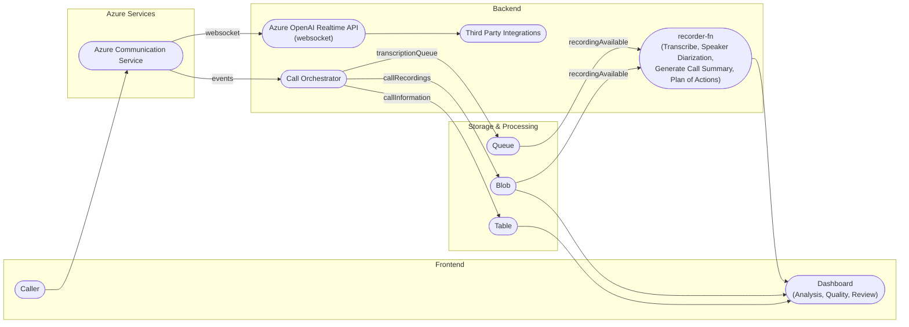

# FirstResponder-AI

An AI-powered mobile phone support system built with Next.js and Python, designed to provide immediate assistance for hardware issues and subscription problems.

## Overview

FirstResponder-AI is an intelligent support system that helps customers with their mobile phone issues. It combines a modern Next.js frontend with a Python backend service, powered by Azure AI services, to provide immediate assistance for both hardware problems and subscription/SIM card issues.

## Architecture



## Features

- **AI-Powered Mobile Support**: Intelligent assistance for hardware and subscription issues
- **Bilingual Support**: Natural conversation in multiple languages
- **Real-time Communication**: Built with Azure Communication Services that extends support to various communication channels
- **Modern UI**: Built with Next.js 15 and React 19 (for rapid prototyping and development)
- **Event Processing**: Integration with Azure Event Grid

## Tech Stack

### Frontend
- Next.js 15
- React 19
- TypeScript
- Tailwind CSS
- Azure SDK for JavaScript
- AI SDK

### Backend
- Python
- Quart (Async web framework)
- Azure OpenAI Service
- Azure Communication Services
- Azure Event Grid
- Azure Storage

## Project Structure

```
firstresponder-ai/
├── frontend/           # Next.js frontend application
├── backend/           # Python backend service
├── recorder-fn/       # Recording functionality
└── .github/          # GitHub workflows and configurations
```

## Getting Started

### Prerequisites

- Node.js (for frontend)
- Python 3.x (for backend)
- Azure subscription with necessary services enabled

### Frontend Setup

1. Navigate to the frontend directory:
   ```bash
   cd frontend
   ```

2. Install dependencies:
   ```bash
   npm install
   ```

3. Start the development server:
   ```bash
   npm run dev
   ```

### Backend Setup

1. Navigate to the backend directory:
   ```bash
   cd backend
   ```

2. Create and activate a virtual environment:
   ```bash
   python -m venv .venv
   source .venv/bin/activate  # On Windows: .venv\Scripts\activate
   ```

3. Install dependencies:
   ```bash
   pip install -r requirements.txt
   ```

4. Start the backend server:
   ```bash
   python main.py
   ```

## Environment Variables

Both frontend and backend require environment variables to be set up. Create `.env` files in both directories with the necessary configuration. See the respective README files in each directory for specific requirements.

### Frontend (`frontend/.env`)

```env
# API endpoint for backend communication
NEXT_PUBLIC_API_URL=http://localhost:8000

# Azure Communication Services connection string (if used in frontend)
NEXT_PUBLIC_ACS_CONNECTION_STRING=your_acs_connection_string

# Any other public keys or config needed by the frontend
```

### Backend (`backend/.env`)

```env
# Azure OpenAI Service
AZURE_OPENAI_API_KEY=your_openai_api_key
AZURE_OPENAI_ENDPOINT=https://your-openai-resource.openai.azure.com/

# Azure Communication Services
AZURE_COMMUNICATION_SERVICE_CONNECTION_STRING=your_acs_connection_string

# Azure Storage
AZURE_STORAGE_CONNECTION_STRING=your_storage_connection_string

# Event Grid
AZURE_EVENT_GRID_TOPIC_ENDPOINT=your_event_grid_topic_endpoint
AZURE_EVENT_GRID_KEY=your_event_grid_key

# Other backend-specific settings
PORT=8000
DEBUG=True
```

### Recorder Function (`recorder-fn/local.settings.json` or `.env`)

If your recorder-fn project uses Azure Functions, configuration is typically in `local.settings.json`:

```json
{
  "IsEncrypted": false,
  "Values": {
    "AzureWebJobsStorage": "your_storage_connection_string",
    "FUNCTIONS_WORKER_RUNTIME": "dotnet",
    "ACS_CONNECTION_STRING": "your_acs_connection_string",
    "TRANSCRIBE_API_KEY": "your_transcribe_api_key"
  }
}
```

Or, if you use a `.env` file for local development:

```env
AZURE_STORAGE_CONNECTION_STRING=your_storage_connection_string
ACS_CONNECTION_STRING=your_acs_connection_string
TRANSCRIBE_API_KEY=your_transcribe_api_key
```

## Contributing

1. Fork the repository
2. Create your feature branch (`git checkout -b feature/amazing-feature`)
3. Commit your changes (`git commit -m 'Add some amazing feature'`)
4. Push to the branch (`git push origin feature/amazing-feature`)
5. Open a Pull Request

## License

This project is licensed under the MIT License - see the LICENSE file for details.

## Support

For support, please open an issue in the GitHub repository or contact the maintainers.
