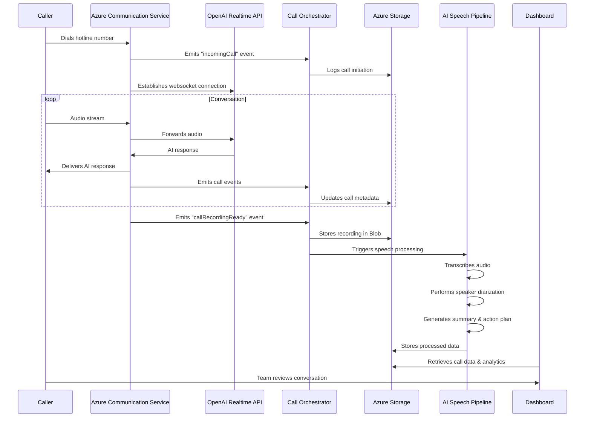

# Project Name

FirstResponder-AI - Real-time Voice Agent for Customer Support

# Description

FirstResponder-AI is a real-time, low-latency voice agent powered by OpenAI's Realtime APIs and Azure Communication Services. Leveraging advanced Speech-to-Speech (S2S) model, it enables natural, human-like conversations with minimal delay. This solution is designed to revolutionize customer support by providing instant, scalable, and highly personalized voice interactions. 

# Problem Definition:

1. **Traditional Customer Support Limitations:** Current IVR and human agent systems suffer from long wait times, limited availability, and high operational costs.
2. **Need for Scalable Solutions:** Organizations need a solution that can handle fluctuating call volumes while maintaining consistent service quality.
3. **Language and Accessibility Barriers:** Traditional support systems often struggle with multilingual support and 24/7 availability.
4. **Cost Efficiency Challenges:** Companies face significant expenses in maintaining traditional customer support infrastructure.

# Architecture and Implementation:

## Architecture Overview:

## Implementation Overview:

FirstResponder-AI implements a sophisticated architecture that combines multiple Azure services to deliver a seamless voice agent experience:

1. **Frontend Layer:**
   - Next.js 15 and React 19 for a modern, responsive dashboard
   - Real-time communication interface using Azure Communication Services
   - Tailwind CSS for beautiful UI components

2. **Backend Services:**
   - Python-based Quart async web framework for handling real-time communications
   - Azure OpenAI Service for natural language processing and response generation
   - Azure Communication Services for voice handling and call management
   - Azure Event Grid for event processing and system coordination
   - Azure Functions for handling call events and orchestration

3. **Storage and Analytics:**
   - Azure Blob Storage for call recordings and data persistence
   - Azure Queue Storage for managing transcription tasks
   - Azure Table Storage for call information and metadata

## Azure Services Integration:

The system leverages several key Azure services:

1. **Azure Communication Services:**
   - Handles voice calls and real-time communication
   - Manages call recording and streaming
   - Enables multi-channel support

2. **Azure OpenAI Service:**
   - Powers real-time voice conversations
   - Enables natural language understanding and generation
   - Provides multilingual support

3. **Azure AI Speech:**
   - Handles transcription and speaker diarization
   - Enables sentiment analysis
   - Generates call summaries and insights

4. **Azure Functions:**
   - Handles call events and orchestration
   - Transforms data for storage and dashboard

## Application Flow:

1. **Caller initiates a call** to the hotline number connected to ACS
2. **ACS** connects the call and emits `incomingCall` event
3. **Call Orchestrator** (Azure Function) listens to events and begins orchestration:
   - Connects to OpenAI Realtime API for voice-agent interaction
   - Stores call details to Table storage
   - On `callRecordingReady`, stores the audio in Blob storage and enqueues for processing
4. **Azure AI Speech Pipeline**:
   - Transcribes the call
   - Performs speaker diarization
   - Generates a structured summary and plan of action
5. **Dashboard** displays:
   - Full call log, transcription, summary
   - Allows human review, callbacks, and annotation
   - Call recording playback and timestamped transcript

## Technologies Used:

- **Frontend:** Next.js 15, React 19, TypeScript, Tailwind CSS
- **Backend:** Python, Quart, Azure SDK
- **AI Services:** Azure OpenAI Service, Azure AI Speech
- **Cloud Infrastructure:** Azure Communication Services, Event Grid, Storage Services
- **Development Tools:** TypeScript, Python 3.x

## Target Audience:

The source code contains a working example of agent designed to cater needs of an electronic devices shop (mobile phones)'s support. But the agent instructions architecture is designed to be extended to cater needs of any organization.

1. **Enterprise Contact Centers:**
   - Organizations looking to modernize customer support
   - Companies seeking cost-effective scaling solutions

2. **Customer Service Providers:**
   - BPO companies
   - Technical support centers

3. **Healthcare and Emergency Services:**
   - 24/7 support requirements
   - Multi-language support needs

4. **Financial Institutions:**
   - Banks and insurance companies
   - Investment firms requiring constant customer support

# Conclusion and Future Works:

## Conclusion

FirstResponder-AI demonstrates the potential of AI-powered voice agents in transforming customer support. By combining Azure's advanced services with real-time AI capabilities, it offers a solution that is not only cost-effective but also provides superior customer experience through instant, natural, and multilingual support.

## Future Work

1. **Enhanced AI Capabilities:**
   - Integration with more specialized AI models
   - Advanced sentiment analysis and emotion detection
   - Improved context awareness and personalization

2. **Specialized Agents Routing:**
   - ACS enables routing of calls to specialized agents based on the nature of the call

3. **Platform Extensions:**
   - Support for additional communication channels via ACS
   - Integration with more third-party services
   - Enhanced analytics and reporting features

4. **Security and Compliance:**
   - Advanced encryption and security features
   - Additional compliance certifications
   - Enhanced privacy controls

## Developers:

- Rahul Patil - [GitHub](https://github.com/r4hulp)
- Sanket Ghorpade - [GitHub](https://github.com/loflet)

## Technology & Languages

- TypeScript
- Python
- Azure OpenAI
- Azure Communication Services
- Azure AI Speech
- Azure Event Grid
- Azure Storage Services
- Next.js
- React

## Project Repository URL

https://github.com/r4hulp/firstresponder-ai

## Deployed Endpoint URL

[Deployment URL to be added]

## Project Video

https://www.youtube.com/watch?v=zdWUlTf20NI

## Team Members

@r4hulp [rahulpp@live.com], @loflet [ghorpade.sanket@hotmail.com] 