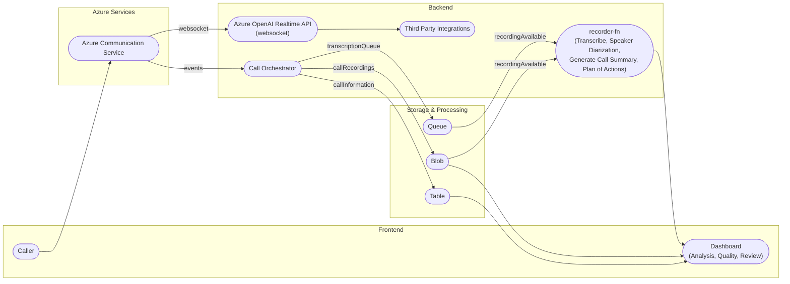

# Project Name

FirstResponder-AI - Real-time Voice Agent for Customer Support

# Description

FirstResponder-AI is an innovative real-time voice agent that revolutionizes customer support by leveraging OpenAI's Realtime APIs and Azure Communication Services. It provides instant, natural, and human-like conversations with minimal latency.

# Problem Definition:

1. **Traditional Customer Support Limitations:** Current IVR and human agent systems suffer from long wait times, limited availability, and high operational costs.
2. **Need for Scalable Solutions:** Organizations need a solution that can handle fluctuating call volumes while maintaining consistent service quality.
3. **Language and Accessibility Barriers:** Traditional support systems often struggle with multilingual support and 24/7 availability.
4. **Cost Efficiency Challenges:** Companies face significant expenses in maintaining traditional customer support infrastructure.

# Architecture and Implementation:

## Architecture Overview:

## Implementation Overview:

FirstResponder-AI implements a sophisticated architecture that combines multiple Azure services to deliver a seamless voice agent experience:

1. **Frontend Layer:**
   - Next.js 15 and React 19 for a modern, responsive dashboard
   - Real-time communication interface using Azure Communication Services
   - Tailwind CSS for beautiful UI components

2. **Backend Services:**
   - Python-based Quart async web framework for handling real-time communications
   - Azure OpenAI Service for natural language processing and response generation
   - Azure Communication Services for voice handling and call management
   - Azure Event Grid for event processing and system coordination

3. **Storage and Analytics:**
   - Azure Blob Storage for call recordings and data persistence
   - Azure Queue Storage for managing transcription tasks
   - Azure Table Storage for call information and metadata

## Azure Services Integration:

The system leverages several key Azure services:

1. **Azure Communication Services:**
   - Handles voice calls and real-time communication
   - Manages call recording and streaming
   - Enables multi-channel support

2. **Azure OpenAI Service:**
   - Powers real-time voice conversations
   - Enables natural language understanding and generation
   - Provides multilingual support

3. **Azure AI Speech:**
   - Handles transcription and speaker diarization
   - Enables sentiment analysis
   - Generates call summaries and insights

## Application Flow:

1. **Call Initiation:**
   - Customer initiates call through Azure Communication Services
   - System establishes real-time connection with OpenAI

2. **Real-time Processing:**
   - Voice input is processed through Azure AI Speech
   - OpenAI generates contextual responses
   - Azure Communication Services delivers voice response

3. **Post-call Processing:**
   - Call recording is stored in Azure Blob Storage
   - Transcription and analysis performed by recorder-fn
   - Results available in dashboard for review

## Technologies Used:

- **Frontend:** Next.js 15, React 19, TypeScript, Tailwind CSS
- **Backend:** Python, Quart, Azure SDK
- **AI Services:** Azure OpenAI Service, Azure AI Speech
- **Cloud Infrastructure:** Azure Communication Services, Event Grid, Storage Services
- **Development Tools:** TypeScript, Python 3.x

## Target Audience:

1. **Enterprise Contact Centers:**
   - Organizations looking to modernize customer support
   - Companies seeking cost-effective scaling solutions

2. **Customer Service Providers:**
   - BPO companies
   - Technical support centers

3. **Healthcare and Emergency Services:**
   - 24/7 support requirements
   - Multi-language support needs

4. **Financial Institutions:**
   - Banks and insurance companies
   - Investment firms requiring constant customer support

# Conclusion and Future Works:

## Conclusion

FirstResponder-AI demonstrates the potential of AI-powered voice agents in transforming customer support. By combining Azure's advanced services with real-time AI capabilities, it offers a solution that is not only cost-effective but also provides superior customer experience through instant, natural, and multilingual support.

## Future Work

1. **Enhanced AI Capabilities:**
   - Integration with more specialized AI models
   - Advanced sentiment analysis and emotion detection
   - Improved context awareness and personalization

2. **Platform Extensions:**
   - Support for additional communication channels
   - Integration with more third-party services
   - Enhanced analytics and reporting features

3. **Security and Compliance:**
   - Advanced encryption and security features
   - Additional compliance certifications
   - Enhanced privacy controls

## Developers:

Rahul Patil & Sanket Ghorpade

## Technology & Languages

- TypeScript
- Python
- Azure OpenAI
- Azure Communication Services
- Azure AI Speech
- Azure Event Grid
- Azure Storage Services
- Next.js
- React

## Project Repository URL

https://github.com/r4hulp/firstresponder-ai

## Deployed Endpoint URL

[Deployment URL to be added]

## Project Video

[Video URL to be added]

## Team Members

@r4hulp [], @loflet [ghorpade.sanket@hotmail.com] 